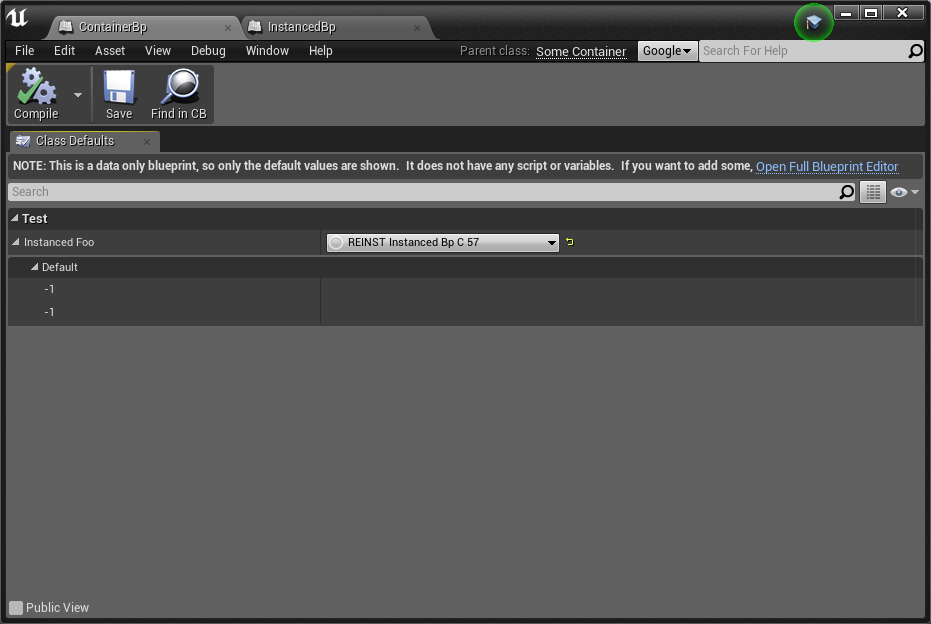

# UE 4.9 Bug

UDN: https://udn.unrealengine.com/questions/267931/49410-opened-blueprint-corrupts-after-another-blue.html

## Steps to reproduce problem

 * Open project InstancedProperty.uproject
 * Open blueprint ContainerBp
 * Open blueprint InstancedBp
 * Compile blueprint InstancedBp

**Expected result**: ContainerBp still have a correct InstancedBp data.

**Actual result**: ContainerBp have InstancedBp with empty fields.



## How to create assets manually step-by-step

### Asset: InstancedBp.uasset

 * Create blueprint from parent class "SomeInstanced" as ```InstancedBp```
 * Add variable "Foo" with type "String"
 * Add variable "Bar" with type "String"
 * Compile it
 * Set default value "Foo Value" to variable "Foo"
 * Set default value "Bar Value" to variable "Bar"
 * Compile it
 * Save it

### Asset: ContainerBp.uasset

 * Create blueprint from parent class "SomeContainer" as ```ContainerBp```
 * Compile it
 * Save it
 * Reopen blueprint
 * Set "Test > Compomenet Foo > Instanced Foo" proeprty in class defaults to ```InstancedBp```
 * Compile it
 * Save it
